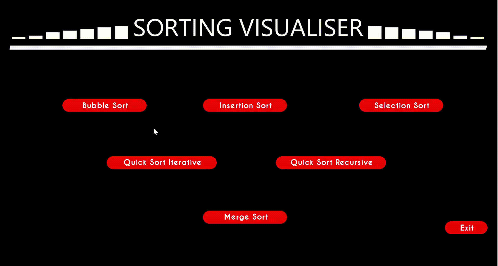
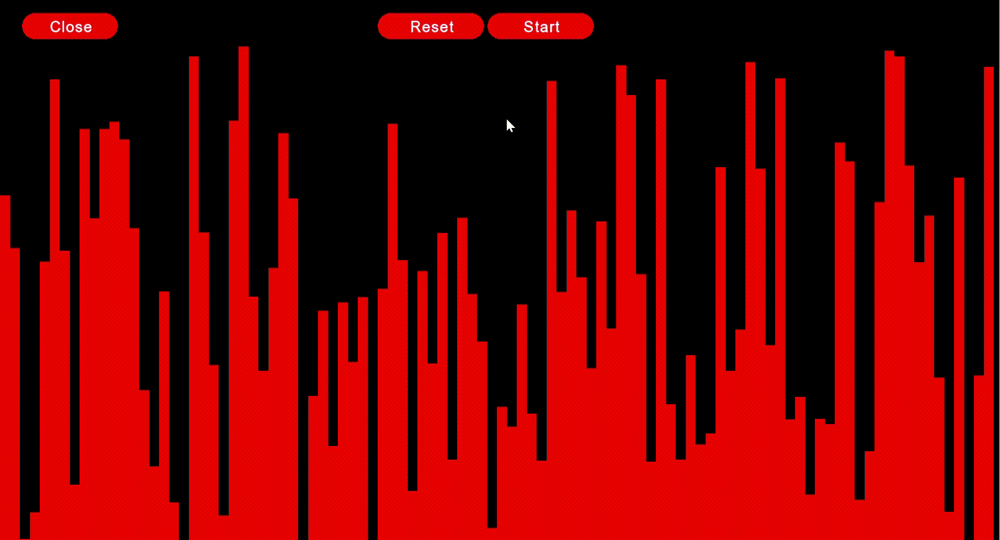
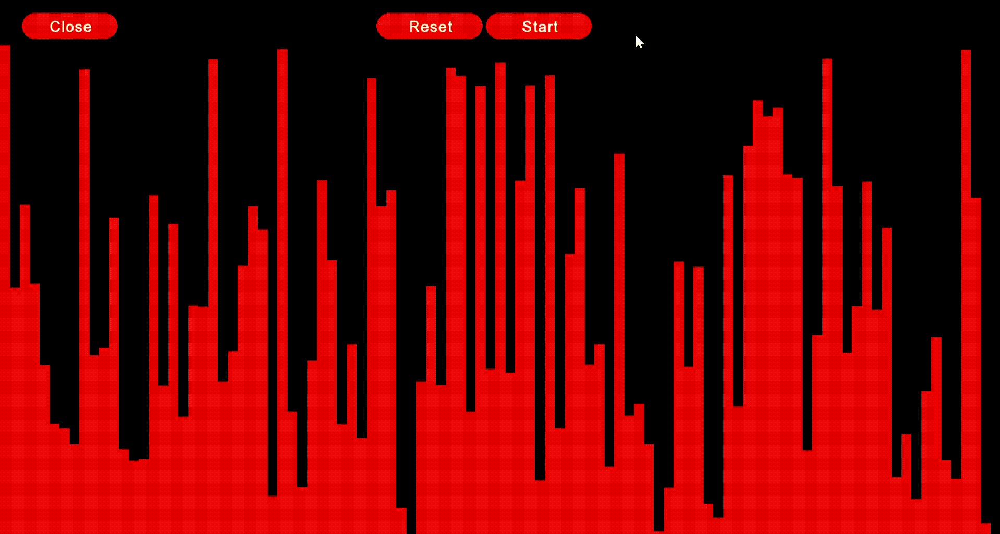
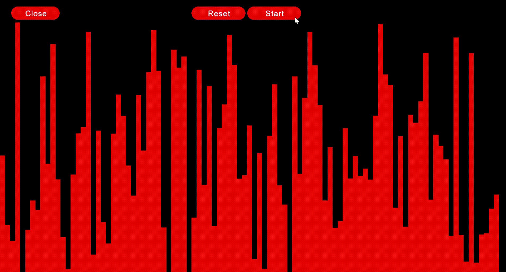
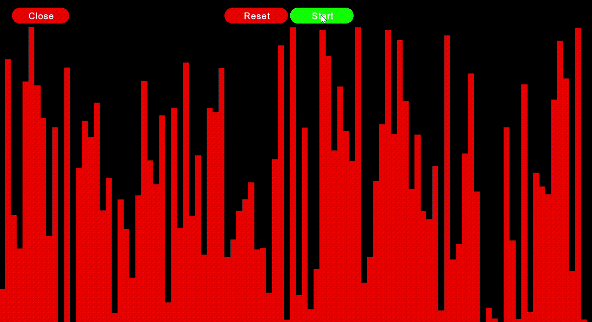
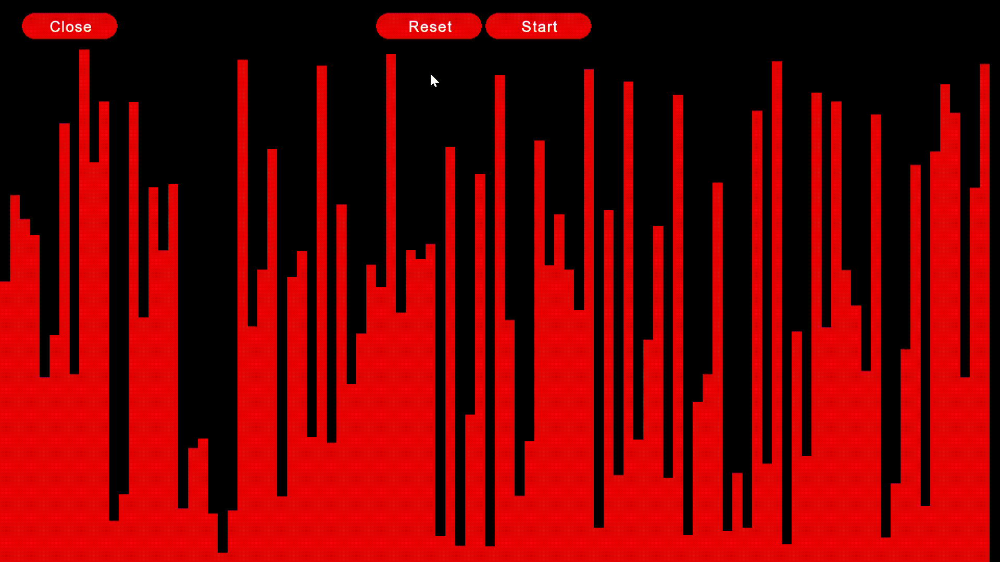
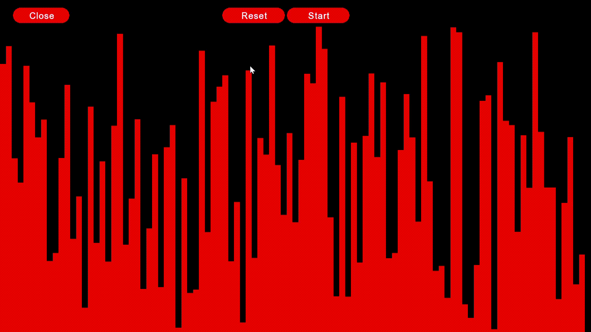
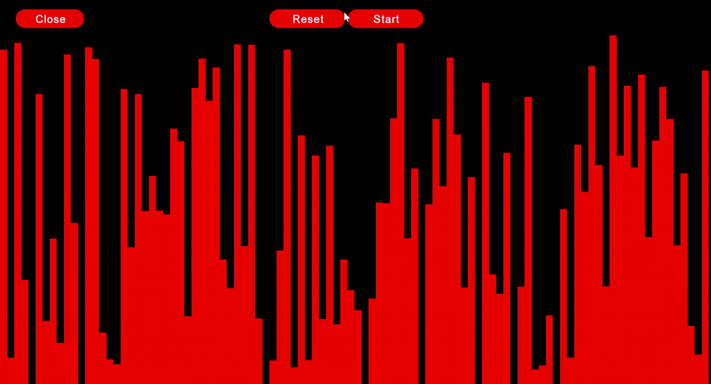

# SORTING VISUALISER
Deep dive into understanding the working of different sorting algorithms by viusalising their working!

Currently, the application incudes 5 sorting algorithms:

* INSERTION SORT
* BUBBLE SORT
* SELECTION SORT
* MERGE SORT
* QUICK SORT (both recursive and iterative)

## Choose the algorithm

## Reset to generate random arrays

# Outputs

# INSERTION SORT

# BUBBLE SORT

# SELECTION SORT

# MERGE SORT

# ITERATIVE QUICK SORT

# RECURSIVE QUICK SORT

